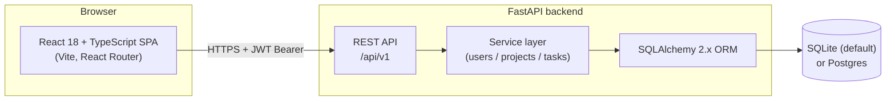

# TaskTracker

A lean, self-hostable task and project management board for small teams — a focused Trello/Linear alternative you can run yourself.

TaskTracker pairs a typed FastAPI backend with a React + TypeScript single-page app. Organise work into projects, track tasks across a `todo → in_progress → done` board, set priorities, assignees and due dates, and secure everything behind JWT authentication. It runs on SQLite out of the box and is ready for Postgres in production.

## Features

- **Projects** — group work into projects scoped to their owner.
- **Task board** — Kanban-style columns (`todo`, `in_progress`, `done`) with one-call moves between columns.
- **Rich tasks** — title, description, priority (`low` / `medium` / `high`), assignee and due date.
- **Filtering & pagination** — list tasks by project, status or assignee with paginated responses.
- **JWT authentication** — register, log in and call the API with a bearer token; passwords hashed with bcrypt.
- **Typed end to end** — Pydantic v2 models on the backend mirrored by TypeScript types on the frontend.
- **Production-shaped** — service layer, dependency injection, centralized config, structured logging, CORS, Docker and CI.
- **Interactive API docs** — OpenAPI / Swagger UI served automatically by FastAPI at `/docs`.

## Architecture

A React SPA talks to a versioned REST API. FastAPI handles routing, validation and auth; a thin service layer holds the business logic; SQLAlchemy 2.x maps the domain to the database. SQLite is the default store and Postgres is a drop-in swap via `DATABASE_URL`.



**Request flow:** the SPA stores a JWT after login and attaches it as an `Authorization: Bearer <token>` header on every call. FastAPI validates the token via a dependency, resolves the current user, and routes the request through the service layer, which owns persistence through SQLAlchemy. Responses are serialized by Pydantic response models (`UserOut` / `ProjectOut` / `TaskOut`), so the password hash never leaves the database.

### Tech stack

| Layer    | Technologies |
|----------|--------------|
| Frontend | React 18, TypeScript, Vite, React Router, CSS Modules, Vitest + Testing Library, ESLint |
| Backend  | Python 3.12, FastAPI, SQLAlchemy 2.x, Pydantic v2 + pydantic-settings, python-jose (JWT), passlib[bcrypt], uvicorn, pytest, ruff |
| Data     | SQLite by default; Postgres-ready via `DATABASE_URL` |
| Ops      | Docker, docker-compose, GitHub Actions CI |

## Project structure

```
tasktracker/
├── README.md
├── docker-compose.yml
├── .github/workflows/ci.yml      # CI: backend ruff+pytest, frontend eslint+build+vitest
├── backend/
│   ├── requirements.txt
│   ├── .env.example              # configuration template (placeholders only)
│   ├── Dockerfile
│   └── app/
│       ├── main.py               # app factory, lifespan, CORS, router wiring
│       ├── config.py             # pydantic-settings Settings
│       ├── database.py           # engine, SessionLocal, create_all()
│       ├── logging_config.py     # structured logging setup
│       ├── seed.py               # idempotent demo data (python -m app.seed)
│       ├── api/
│       │   ├── deps.py           # DBSession / CurrentUser dependencies
│       │   └── routers/          # health, auth, users, projects, tasks
│       ├── core/security.py      # JWT + password hashing
│       ├── models/               # SQLAlchemy ORM: user, project, task
│       ├── schemas/              # Pydantic v2: user, project, task, token
│       └── services/             # business logic: user/project/task services
│   └── tests/                    # pytest: auth, tasks, projects
└── frontend/
    ├── package.json
    ├── tsconfig.json
    ├── vite.config.ts
    ├── .eslintrc.cjs
    ├── index.html
    ├── Dockerfile
    └── src/
        ├── main.tsx App.tsx types.ts
        ├── api/client.ts         # typed fetch client (base URL, auth header, errors)
        ├── components/           # Header, Login, TaskBoard, TaskColumn, TaskCard, TaskForm
        ├── pages/                # LoginPage, BoardPage
        ├── hooks/                # useAuth, useProjects, useTasks
        ├── styles/               # CSS modules + global styles
        └── __tests__/            # Vitest component tests
```

## Quick start (Docker)

The fastest way to run the full stack. Builds both services, persists SQLite to a named volume, and wires CORS and the API base URL between them.

```bash
docker-compose up --build
```

- Frontend: http://localhost:5173
- Backend API: http://localhost:8000
- API docs (Swagger UI): http://localhost:8000/docs
- Health check: http://localhost:8000/health

On startup the backend runs an idempotent seed, so you can sign in immediately with the demo account
and land on a populated board:

- **Email:** `demo@tasktracker.dev`
- **Password:** `change-me`

Optional overrides (all have safe defaults) can be exported before running, for example `SECRET_KEY`, `ACCESS_TOKEN_EXPIRE_MINUTES`, `BACKEND_CORS_ORIGINS`, `LOG_LEVEL` and `VITE_API_BASE_URL` (and the `SEED_USER_*` credentials).

## Local development

Run the backend and frontend in two terminals.

### Backend

```bash
cd backend
python -m venv .venv && source .venv/bin/activate
pip install -r requirements.txt
cp .env.example .env                  # then edit values as needed
uvicorn app.main:app --reload         # http://localhost:8000
```

Optionally load demo data (a demo user, a sample project and a few tasks):

```bash
python -m app.seed
```

For a production-style run:

```bash
uvicorn app.main:app --host 0.0.0.0 --port 8000
```

### Frontend

```bash
cd frontend
npm install
npm run dev                           # http://localhost:5173
```

The dev server expects the API at `http://localhost:8000` by default; override it with `VITE_API_BASE_URL` (see `frontend/.env.example`). To produce a static bundle:

```bash
npm run build
npm run preview                       # serve the built bundle locally
```

## API summary

All endpoints are versioned under `/api/v1`, except the health check at `/health`. Endpoints marked **Auth** require an `Authorization: Bearer <token>` header.

| Method | Path | Auth | Description |
|--------|------|:----:|-------------|
| `GET`    | `/health`                  |     | Liveness check; returns status and version. |
| `POST`   | `/api/v1/auth/register`    |     | Register a user `{email, password, full_name}` → `201 UserOut`. |
| `POST`   | `/api/v1/auth/login`       |     | Log in with JSON `{email, password}` → `{access_token, token_type: "bearer"}`. |
| `GET`    | `/api/v1/users/me`         |  ✓  | Current authenticated user (`UserOut`). |
| `GET`    | `/api/v1/projects`         |  ✓  | List your projects. |
| `POST`   | `/api/v1/projects`         |  ✓  | Create a project → `201 ProjectOut`. |
| `GET`    | `/api/v1/projects/{id}`    |  ✓  | Get a project. |
| `PATCH`  | `/api/v1/projects/{id}`    |  ✓  | Partially update a project. |
| `DELETE` | `/api/v1/projects/{id}`    |  ✓  | Delete a project and its tasks → `204`. |
| `GET`    | `/api/v1/tasks`            |  ✓  | List tasks; filters `project_id`, `status`, `assignee_id`, `page`, `size` → `{items, total, page, size}`. |
| `POST`   | `/api/v1/tasks`            |  ✓  | Create a task → `201 TaskOut`. |
| `GET`    | `/api/v1/tasks/{id}`       |  ✓  | Get a task. |
| `PATCH`  | `/api/v1/tasks/{id}`       |  ✓  | Partially update a task. |
| `DELETE` | `/api/v1/tasks/{id}`       |  ✓  | Delete a task → `204`. |
| `POST`   | `/api/v1/tasks/{id}/move`  |  ✓  | Move a task to a new column with `{status}` → `TaskOut`. |

Response models (`UserOut`, `ProjectOut`, `TaskOut`) are the public shapes; `UserOut` never includes the password hash. The full, interactive specification is available at `/docs` (Swagger UI) and `/redoc` when the backend is running.

### Data model

| Entity   | Fields |
|----------|--------|
| User     | `id`, `email`, `full_name`, `is_active`, `created_at` |
| Project  | `id`, `name`, `description`, `owner_id`, `created_at` |
| Task     | `id`, `title`, `description`, `status` (`todo`/`in_progress`/`done`), `priority` (`low`/`medium`/`high`), `project_id`, `assignee_id`, `due_date`, `created_at`, `updated_at` |

## Testing & linting

### Backend

```bash
cd backend
ruff check .          # lint
pytest                # tests
```

### Frontend

```bash
cd frontend
npm run lint          # eslint
npm run build         # type-check + production build
npm run test          # vitest
```

Both suites run on every push and pull request via the **CI** GitHub Actions workflow (`.github/workflows/ci.yml`): the backend job runs `ruff check .` then `pytest`; the frontend job runs `npm run lint`, `npm run build` and `npm run test`.

## Configuration

Backend configuration is environment-driven via `pydantic-settings`. Copy the template and adjust values for your environment:

```bash
cp backend/.env.example backend/.env
```

Settings are read from the process environment first, then from a local `.env` file. Key variables:

| Variable | Default | Description |
|----------|---------|-------------|
| `APP_NAME` | `TaskTracker` | Application name shown in OpenAPI metadata. |
| `ENVIRONMENT` | `development` | One of `development`, `staging`, `production`. |
| `LOG_LEVEL` | `INFO` | Logging level. |
| `DATABASE_URL` | `sqlite:///./data/app.db` | SQLAlchemy URL; swap for a Postgres URL in production. |
| `SECRET_KEY` | `change-me` | JWT signing key — **set a strong value outside local dev**. |
| `ACCESS_TOKEN_EXPIRE_MINUTES` | `60` | Access-token lifetime in minutes. |
| `JWT_ALGORITHM` | `HS256` | JWT signing algorithm. |
| `BACKEND_CORS_ORIGINS` | `http://localhost:5173,http://127.0.0.1:5173` | Comma-separated allowed frontend origins. |
| `SEED_USER_EMAIL` / `SEED_USER_PASSWORD` / `SEED_USER_NAME` | demo values | Credentials used by `app/seed.py`. |

The frontend reads a single build-time variable, `VITE_API_BASE_URL` (default `http://localhost:8000`), documented in `frontend/.env.example`. Because Vite inlines `VITE_*` variables into the static bundle, it must be set at build time.

> **Secrets:** `.env.example` files contain placeholders only. Never commit a real `.env` or production secret; always override `SECRET_KEY` (and seed credentials) outside local development.

## License

Released under the MIT License.
